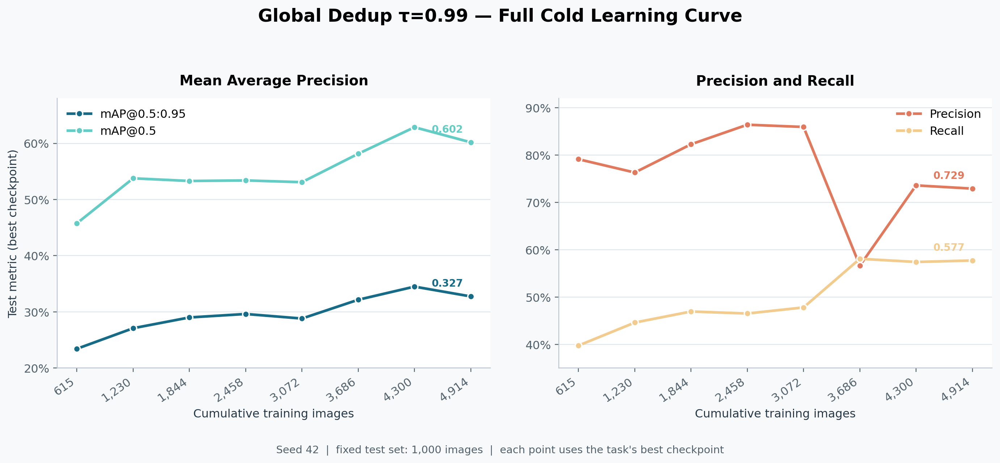

# Global Dedup τ=0.99 学习曲线结果

## 图表口径

- 实验：`GlobalDedupTau099_PostSplit`，Full Cold，YOLOv5s，训练 seed 从 42 到 49。
- 数据：先对全部 9,573 张图进行相邻帧去冗余（τ=0.99，temporal window=1），再固定划分 1,000 张 validation、1,000 张 test，并将剩余 4,914 张训练图分为 8 个 stage。
- 横轴：各阶段累计训练图像数，来自 `task_result.json -> cost.selected_count`。
- 纵轴：固定 1,000 张 test 集上的指标，来自 `task_result.json -> metrics.best.test`。
- checkpoint：每个点都使用该阶段按 mAP@0.5 选择的 `best.pt`；不是 `last.pt`。

## 数据

| Stage | 累计训练图像 | mAP@0.5:0.95 | mAP@0.5 | Precision | Recall |
|---|---:|---:|---:|---:|---:|
| 0 | 615 | 0.2343 | 0.4576 | 0.7915 | 0.3975 |
| 1 | 1,230 | 0.2709 | 0.5378 | 0.7633 | 0.4461 |
| 2 | 1,844 | 0.2901 | 0.5330 | 0.8231 | 0.4695 |
| 3 | 2,458 | 0.2962 | 0.5340 | 0.8644 | 0.4653 |
| 4 | 3,072 | 0.2881 | 0.5309 | 0.8597 | 0.4781 |
| 5 | 3,686 | 0.3216 | 0.5815 | 0.5664 | 0.5809 |
| 6 | 4,300 | **0.3450** | **0.6287** | 0.7361 | 0.5743 |
| 7 | 4,914 | 0.3275 | 0.6019 | 0.7293 | 0.5773 |

## 如何解读

从 615 张增加到 4,914 张时，mAP@0.5:0.95 从 0.2343 提升到 0.3275，绝对提升 0.0932；mAP@0.5 从 0.4576 提升到 0.6019。曲线并非单调：两项 mAP 都在 stage6（4,300 张）达到本次单 seed 运行的最高值，加入最后 614 张后分别下降 0.0175 和 0.0269。

stage5 出现明显的 Precision/Recall 权衡变化：Precision 从 0.8597 降至 0.5664，同时 Recall 从 0.4781 升至 0.5809。最终 stage7 的 Precision/Recall 为 0.7293/0.5773。

这些点只能描述当前固定划分、单次 seed schedule 和 Full Cold 配置下的结果；stage6 的峰值不应直接解释为“4,300 张就是最佳训练集规模”。若要下稳定结论，需要重复 seed 或进一步检查 stage7 新增样本的分布。

## 文件

- `learning_curve.png`：适合直接查看或插入报告的位图。
- `learning_curve.svg`：可无损缩放的矢量图。
- `learning_curve_metrics.csv`：图中全部数据点及 task 路径。
- `summary.json`：生成口径和最终 stage 摘要。
- `../../scripts/generate_learning_curve.py`：从 `experiment/sequence/` 中的原始任务结果重新生成上述文件。
